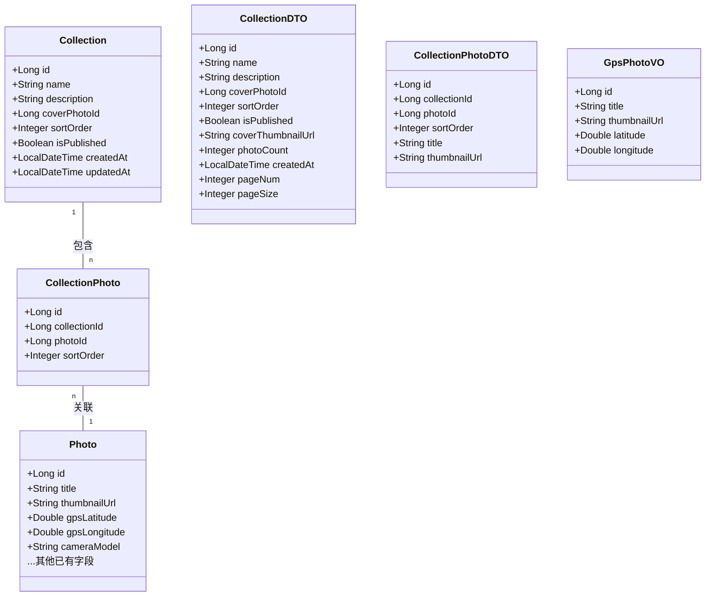
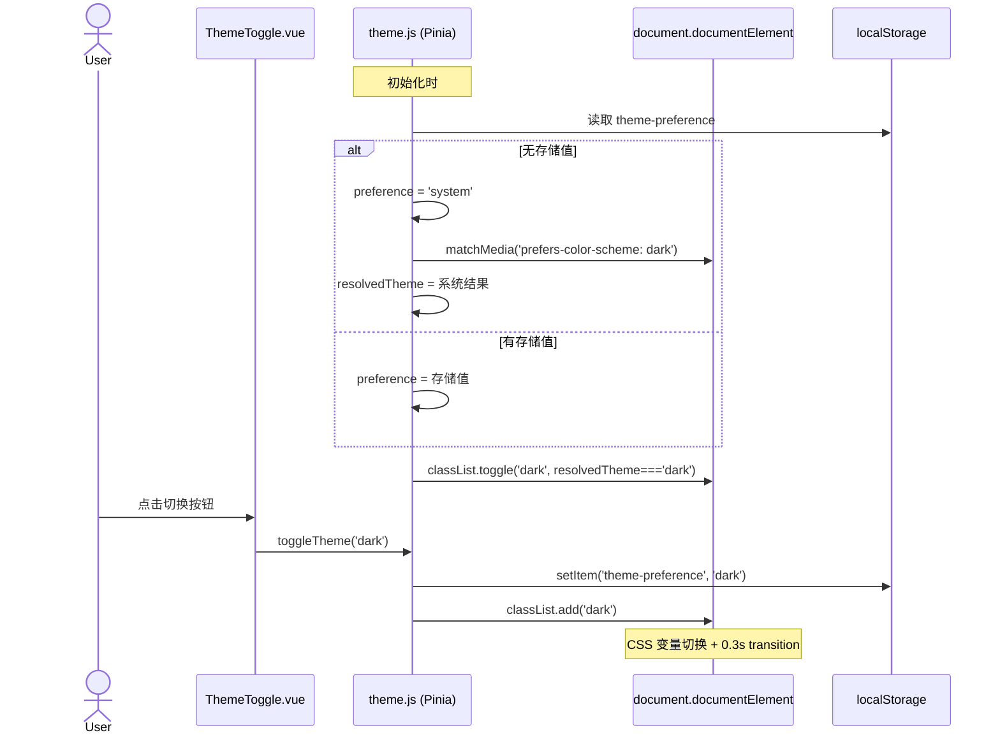
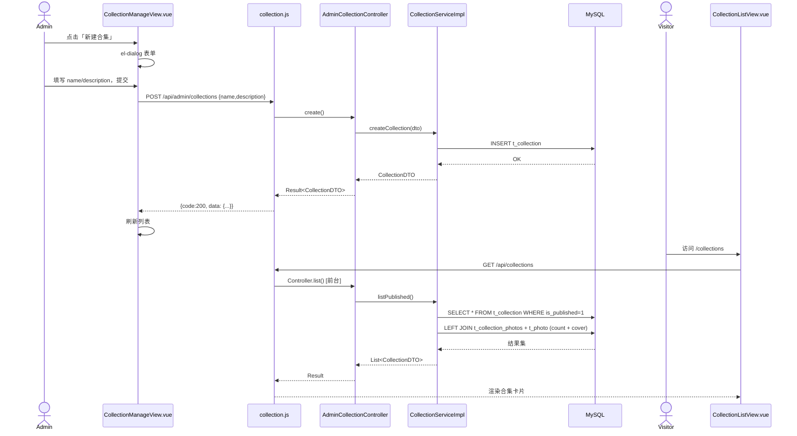
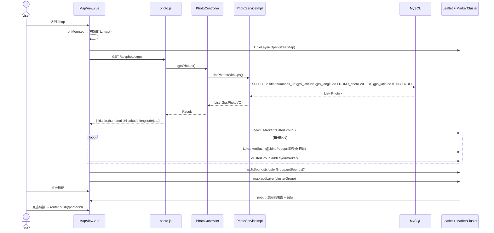
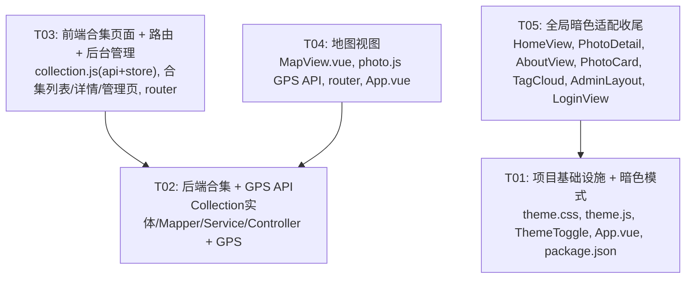

# 摄影相册 P0 功能 — 系统架构设计

> 架构师：高见远（Bob）  
> 日期：2025-07-15  
> 基于 PRD v1.0

---

## Part A: 系统设计

### 1. 实现方案与框架选型

#### 1.1 暗色模式（P0-1）

**技术挑战：**
- 全局颜色变量统一切换，覆盖 Element Plus + 自定义样式
- 需要感知用户系统主题偏好（`prefers-color-scheme`）
- 状态持久化到 localStorage
- 平滑过渡动画（0.3s）

**方案：CSS 变量 + Element Plus 暗色变量**
- 使用 `document.documentElement.classList.toggle('dark')` 作为全局暗色开关
- Element Plus 3.x 原生支持通过 `html.dark` 触发暗色变量
- 在 Vue 3 中创建 `useThemeStore`（Pinia），封装：
  - `preference` 三态：`'system' | 'light' | 'dark'`
  - `resolvedTheme` 计算属性（`'light' | 'dark'`）
  - 初始化时读取 `localStorage` + `matchMedia`
  - 通过 `watchEffect` 同步 DOM class
- 将项目现有硬编码颜色（如 `#1a1a2e`、`#fff`、`#f0f2f5` 等）替换为 CSS 变量引用
- `transition: background-color 0.3s, color 0.3s, border-color 0.3s` 作用于全局

**不引入新依赖。**

#### 1.2 照片合集/专题（P0-2）

**技术挑战：**
- 多对多关系建模（合集 ↔ 照片）
- 封面图片选择与排序
- 前台展示 + 后台 CRUD 双入口

**后端方案：**
- 新增 `Collection` 和 `CollectionPhoto` 两个实体 + MyBatis Plus 映射
- 标准分层：`entity → mapper → service/impl → controller → dto`
- DDL 建两张表 `t_collection` + `t_collection_photos`
- 合集照片列表返回时关联查询 Photo → 填充 `thumbnailUrl`、`title` 等
- 后台 API 全部挂 `/api/admin/collections`，前台 API 挂 `/api/collections`

**前端方案：**
- 新增 `src/api/collection.js` — 前台/后台 API 统一管理
- 新增 Pinia store `src/stores/collection.js` — 前台合集列表 + 详情
- 新建页面：合集列表（`CollectionListView`）、合集详情（`CollectionDetailView`）
- 新建后台页面：合集管理（`admin/CollectionManageView`）
- 内置 Element Plus `<el-dialog>` 弹窗处理创建/编辑表单，减少页面跳转

#### 1.3 地图视图（P0-3）

**技术挑战：**
- GPS 坐标展示 + 聚合（marker cluster）
- 适配 Leaflet 的 Vue 集成
- 照片缩略图弹窗

**方案：**
- 新增 npm 包：`leaflet` + `leaflet.markercluster`
- 不使用 `vue-leaflet` 等封装（避免额外依赖链），直接操作 Leaflet DOM API
- 在 `onMounted` 中初始化地图实例，在 `onUnmounted` 中销毁
- 新增 API：`GET /api/photos/gps` 返回含 GPS 数据的照片列表
- `fitBounds` 自动适配所有标记点
- 点击标记 → 通过 `L.popup` 展示缩略图 + 标题 + 链接跳转详情页

**后端 GPS 字段确认：** 当前 `Photo` 实体 **缺少** `gpsLatitude` 和 `gpsLongitude` 字段，需在任务中补充（详见第 8 节"待明确"）。

---

### 2. 文件列表

#### 2.1 后端文件（Java / Spring Boot）

```
photo-album-backend/src/main/java/com/photoalbum/
├── entity/
│   ├── Collection.java              [新建] 合集实体
│   ├── CollectionPhoto.java         [新建] 合集-照片关联实体
│   └── Photo.java                   [修改] 补充 gpsLatitude/gpsLongitude
├── mapper/
│   ├── CollectionMapper.java        [新建] 合集 Mapper
│   └── CollectionPhotoMapper.java   [新建] 关联 Mapper
├── service/
│   ├── CollectionService.java       [新建] 合集服务接口
│   └── impl/
│       └── CollectionServiceImpl.java [新建] 合集服务实现
├── controller/
│   ├── CollectionController.java    [新建] 前台合集控制器
│   ├── AdminCollectionController.java [新建] 后台合集控制器
│   └── PhotoController.java         [修改] 新增 GET /api/photos/gps
├── dto/
│   ├── CollectionDTO.java           [新建] 合集 DTO
│   └── CollectionPhotoDTO.java      [新建] 合集-照片 DTO
└── PhotoAlbumApplication.java      （无需修改，MyBatis Plus 自动扫描）
```

数据库 DDL：
```
01_create_collections.sql            [新建]
```

#### 2.2 前端文件（Vue 3 / Vite）

```
photo-album-frontend/src/
├── api/
│   └── collection.js                [新建] 合集 API 请求层
├── stores/
│   ├── theme.js                     [新建] 暗色模式状态
│   └── collection.js                [新建] 合集状态
├── views/
│   ├── CollectionListView.vue       [新建] 前台合集列表
│   ├── CollectionDetailView.vue     [新建] 前台合集详情
│   ├── MapView.vue                  [新建] 地图视图
│   └── admin/
│       ├── CollectionManageView.vue [新建] 后台合集管理
│       └── AdminLayout.vue          [修改] 侧边栏增加「合集管理」入口
├── components/
│   ├── ThemeToggle.vue              [新建] 暗色模式切换按钮
│   └── PhotoCard.vue                [修改] 适配暗色模式 CSS 变量
├── router/
│   └── index.js                     [修改] 新增 /collections, /collections/:id, /map, /admin/collections
├── App.vue                          [修改] 导航栏增加合集入口 + ThemeToggle + 暗色适配
├── styles/
│   └── theme.css                    [新建] CSS 变量定义（亮/暗两套）
└── package.json                     [修改] 新增 leaflet, leaflet.markercluster
```

---

### 3. 数据结构与接口

#### 3.1 DDL

```sql
-- 合集表
CREATE TABLE t_collection (
    id              BIGINT AUTO_INCREMENT PRIMARY KEY,
    name            VARCHAR(100)  NOT NULL COMMENT '合集名称',
    description     TEXT          COMMENT '合集描述',
    cover_photo_id  BIGINT        COMMENT '封面照片 ID',
    sort_order      INT DEFAULT 0 COMMENT '排序权重（越大越前）',
    is_published    TINYINT(1) DEFAULT 0 COMMENT '是否发布(0=草稿,1=已发布)',
    created_at      DATETIME DEFAULT CURRENT_TIMESTAMP,
    updated_at      DATETIME DEFAULT CURRENT_TIMESTAMP ON UPDATE CURRENT_TIMESTAMP
) COMMENT='照片合集';

-- 合集-照片关联表（多对多）
CREATE TABLE t_collection_photos (
    id             BIGINT AUTO_INCREMENT PRIMARY KEY,
    collection_id  BIGINT NOT NULL COMMENT '合集 ID',
    photo_id       BIGINT NOT NULL COMMENT '照片 ID',
    sort_order     INT DEFAULT 0 COMMENT '排序',
    INDEX idx_collection (collection_id),
    INDEX idx_photo (photo_id),
    UNIQUE KEY uk_collection_photo (collection_id, photo_id)
) COMMENT='合集-照片关联';
```

#### 3.2 类图 — 后端实体 & DTO



#### 3.3 API 签名

##### 前台 API

| 方法 | 路径 | 说明 |
|------|------|------|
| `GET` | `/api/collections` | 获取已发布合集列表（含封面缩略图 + 照片数） |
| `GET` | `/api/collections/{id}` | 合集详情（含照片列表 + 排序） |
| `GET` | `/api/photos/gps` | 获取含 GPS 坐标的照片列表 |

##### 后台 API（需认证）

| 方法 | 路径 | 说明 |
|------|------|------|
| `GET` | `/api/admin/collections` | 分页获取所有合集（含草稿） |
| `POST` | `/api/admin/collections` | 创建合集 |
| `PUT` | `/api/admin/collections/{id}` | 编辑合集信息 |
| `DELETE` | `/api/admin/collections/{id}` | 删除合集（级联删除关联） |
| `POST` | `/api/admin/collections/{id}/photos` | 向合集添加照片 `{photoIds:[1,2,3]}` |
| `DELETE` | `/api/admin/collections/{id}/photos/{photoId}` | 从合集移除照片 |
| `PUT` | `/api/admin/collections/{id}/photos/sort` | 更新照片排序 `{items:[{photoId:1,sortOrder:0},...]}` |

**响应格式** — 统一使用 `Result<T>`：`{ code: 200, data: ..., message: "操作成功" }`

---

### 4. 程序调用流程

#### 4.1 暗色模式切换



#### 4.2 合集 CRUD（后台创建 + 前台查看）



#### 4.3 地图视图加载



---

### 5. 待明确事项

| # | 事项 | 假设/决策 |
|---|------|-----------|
| 1 | **GPS 字段缺失** — 当前 `Photo.java` 无 `gpsLatitude`/`gpsLongitude` 字段 | 需在 T02 中补充字段到实体 + 数据库 ALTER TABLE |
| 2 | GPS 数据来源 — 现有 EXIF 解析是否已提取经纬度 | 假设已有 `exifInfo` JSON 包含坐标，但需单独存字段（PRD 明确提到已有字段） |
| 3 | 合集封面图 — 如果用户不选封面，默认取第一张 | 设计中已采用：coverPhotoId 可为空，列表展示时 fallback 到第一张 |
| 4 | 合集发布状态 — 前台只展示 `is_published=1` 的合集 | 已按此设计 |
| 5 | `leaflet.markercluster` 的 CSS/图片资源路径 — Vite 需配置静态资源 | 在 T01 中通过 `npm install` 解决，不需要额外配置 |
| 6 | OpenStreetMap 瓦片服务 — 是否需要国内 CDN 加速 | 默认使用 `https://{s}.tile.openstreetmap.org/{z}/{x}/{y}.png` |

---

## Part B: 任务分解

### 6. 依赖包列表

#### 前端新增

```
- leaflet@^1.9.4: 地图库
- leaflet.markercluster@^1.5.3: 标记聚合插件
```

#### 前端已有（不新增）

```
- vue@^3.5.13: 前端框架
- vue-router@^4.5.0: 路由
- pinia@^2.3.0: 状态管理
- element-plus@^2.13.7: UI 组件库
- axios@^1.7.9: HTTP 请求
- @vitejs/plugin-vue@^5.2.1: Vite 插件
- vite@^6.0.5: 构建工具
```

#### 后端（无新增三方依赖，全部使用现有框架）

```
- Spring Boot 3 + JDK 17
- MyBatis Plus（已集成，代码生成器可选）
- MySQL 8.x
- Lombok（已集成）
```

---

### 7. 任务列表

> **硬约束：不超过 5 个任务。每个任务至少 3 个文件。第一个任务是基础设施。**

| Task ID | 任务名称 | 源文件 | 依赖 | 优先级 |
|---------|----------|--------|------|--------|
| **T01** | **项目基础设施 + 暗色模式** | **`src/styles/theme.css`** [新建]、**`src/stores/theme.js`** [新建]、**`src/components/ThemeToggle.vue`** [新建]、**`src/App.vue`** [修改]、**`package.json`** [修改] | — | P0 |
| **T02** | **后端合集 + GPS API** | **`entity/Collection.java`** [新建]、**`entity/CollectionPhoto.java`** [新建]、**`entity/Photo.java`** [修改]、**`mapper/CollectionMapper.java`** [新建]、**`mapper/CollectionPhotoMapper.java`** [新建]、**`service/CollectionService.java`** [新建]、**`service/impl/CollectionServiceImpl.java`** [新建]、**`controller/CollectionController.java`** [新建]、**`controller/AdminCollectionController.java`** [新建]、**`controller/PhotoController.java`** [修改]、**`dto/CollectionDTO.java`** [新建]、**`dto/CollectionPhotoDTO.java`** [新建]、**`01_create_collections.sql`** [新建] | — | P0 |
| **T03** | **前端合集页面 + 路由 + 后台合集管理** | **`src/api/collection.js`** [新建]、**`src/stores/collection.js`** [新建]、**`src/views/CollectionListView.vue`** [新建]、**`src/views/CollectionDetailView.vue`** [新建]、**`src/views/admin/CollectionManageView.vue`** [新建]、**`src/router/index.js`** [修改]、**`src/views/admin/AdminLayout.vue`** [修改]、**`src/views/HomeView.vue`** [修改] | T02 | P0 |
| **T04** | **地图视图（全栈）** | **`src/views/MapView.vue`** [新建]、**`src/api/photo.js`** [修改]、**`src/router/index.js`** [修改]、**`src/App.vue`** [修改]、**`controller/PhotoController.java`** [修改]、**`service/impl/PhotoServiceImpl.java`** [修改] | T02 | P0 |
| **T05** | **全局暗色适配收尾** | **`src/views/HomeView.vue`** [修改]、**`src/views/PhotoDetailView.vue`** [修改]、**`src/views/AboutView.vue`** [修改]、**`src/components/PhotoCard.vue`** [修改]、**`src/components/TagCloud.vue`** [修改]、**`src/views/admin/AdminLayout.vue`** [修改]、**`src/views/admin/LoginView.vue`** [修改] | T01 | P0 |

---

### 8. 共享知识（跨文件约定）

```
## CSS 变量体系（定义在 theme.css）

### 亮色模式（:root 默认）
--bg-primary: #ffffff           // 页面主背景
--bg-secondary: #f0f2f5         // 次级背景（卡片区）
--bg-header: #1a1a2e            // 顶栏背景
--text-primary: #1a1a2e         // 主文字
--text-secondary: #666666       // 次文字
--text-muted: #aaaaaa           // 弱文字
--border-color: #e8e8e8         // 边框
--accent: #378ADD               // 主题色
--card-bg: #ffffff              // 卡片背景

### 暗色模式（html.dark）
--bg-primary: #121212
--bg-secondary: #1e1e1e
--bg-header: #0d0d0d
--text-primary: #e0e0e0
--text-secondary: #aaaaaa
--text-muted: #666666
--border-color: #333333
--accent: #5DADE2
--card-bg: #1e1e1e

### 过渡
* { transition: background-color 0.3s ease, color 0.3s ease, border-color 0.3s ease; }

## Element Plus 暗色
- 通过 html.dark 自动触发 Element Plus 内置暗色变量
- 无需额外配置

## API 规范
- 所有 API 响应格式：{ code: 200, data: ..., message: "操作成功" }
- 分页参数：pageNum（从1开始）, pageSize
- 后台 API 路由前缀统一为 /api/admin/
- 前台 API 路由前缀统一为 /api/

## 多对多关联删除
- 删除 Collection 时级联删除 t_collection_photos 中对应记录
- 删除 Photo 时级联删除 t_collection_photos 中对应记录

## 排序逻辑
- sort_order 越大越靠前
- 合集列表按 sort_order DESC, created_at DESC 排序
- 合集内照片按 sort_order ASC 排序

## Leaflet 使用约定
- 默认中心点：[35.0, 105.0]（中国地理中心）
- 默认缩放：5
- 瓦片源：OpenStreetMap（无需 API key）
- MarkerCluster 配置：maxClusterRadius=50, spiderfyOnMaxZoom=true
```

---

### 9. 任务依赖图



---

> **回传信息：** 以上为完整系统设计 + 任务分解，包含 5 个有序任务、完整文件列表、DDL、API 签名、Mermaid 时序图/类图/依赖图。请主理人（齐活林）审阅后分派实施。
